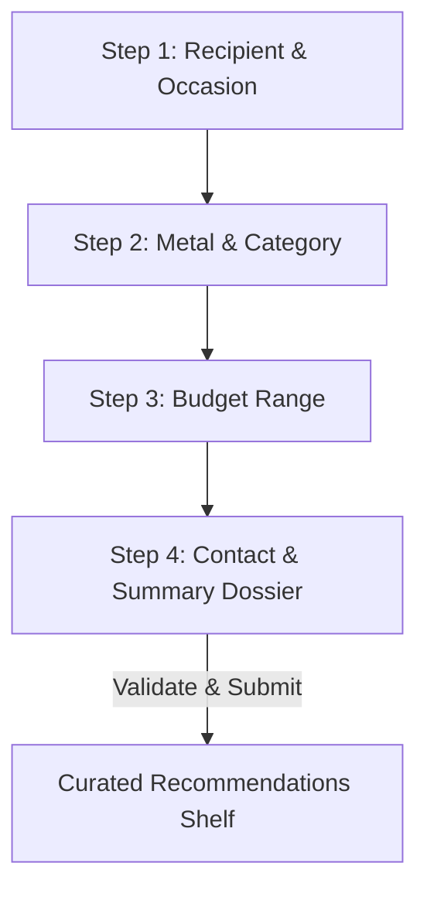

# Diavo Jewels Style Finder & Gift Quiz Funnel

An interactive, high-end product curation and gift selection funnel built for **Diavo Jewels** ([diavojewels.com](https://diavojewels.com/)). This application guides visitors through style, metal, stone, and budget preferences to deliver dynamically curated jewelry recommendations along with an exclusive voucher code.

---

## 🛠️ Tech Stack & Libraries

This frontend application is built to deliver a lightweight, high-performance, and responsive user experience.

### Core Stack
*   **HTML5**: Semantic markup containing form elements, custom grids, selection cards, and validation messages.
*   **CSS3**: Custom design tokens utilizing CSS custom properties for theming, CSS Grid for card layouts, and smooth transition animations (fade-in, slide-up, scale hover transformations).
*   **JavaScript (ES6+)**: Custom state machine managing step navigation, input validation, live receipt summary population, and a bespoke product catalog filtering engine.

### Third-Party CDNs
*   **Phosphor Icons**: Integrated via unpkg CDN (`@phosphor-icons/web`) to display elegant icons (rings, crowns, sparks, users, currency).
*   **Google Fonts**: Links to `Playfair Display` (serif typography representing editorial elegance) and `Jost` (geometric sans-serif representing modern cleanliness).

---

## 🧭 Funnel Step Routine

The wizard manages progression through a 4-step workflow, filtering inventory based on user preferences.

### Step 1: Recipient & Occasion
*   **Selections**: Recipient (Partner, Family, Friend, Myself) and Occasion (Anniversary, Birthday, Daily, Wedding).
*   **Interactions**: Selectable card grids with instant active visual states.

### Step 2: Metal & Style Preferences
*   **Selections**: Metal Type (Yellow Gold, Sterling Silver, Rose Gold, Platinum), Category (Rings, Necklaces, Earrings, Bracelets), and Stone choice.

### Step 3: Budget Range
*   **Selections**: Choice between four distinct budget segments (Under ₹5,000 up to ₹50,000+).

### Step 4: Contact & Style Dossier
*   **Inputs**: Customer Name, Phone Number, and Email.
*   **Live Dossier**: Dynamically displays a "Style Dossier" certificate matching their selected parameters.
*   **Validation**: 
    *   Name must be at least 2 characters.
    *   Phone number must contain at least 8 digits.
    *   Email is mandatory and must match standard email syntax.

### Success Curation Shelf
*   **Voucher**: Generates a voucher card with a copy-to-clipboard trigger.
*   **Curation Engine**: Filters a product database array, prioritizing items matching the user's budget and preferred metal type.
*   **Action Links**: Custom CTA buttons directing users to shop the curated items directly on the official store.

---

## 🚀 How to Run Locally

Since this is a client-side frontend project, no building or backend server setup is required:
1. Double-click [index.html](file:///c:/Pojects/Diavo-Jewels-Funnel/index.html) to open it in any web browser.
2. For testing responsiveness, toggle the inspect element view to mobile sizes.
