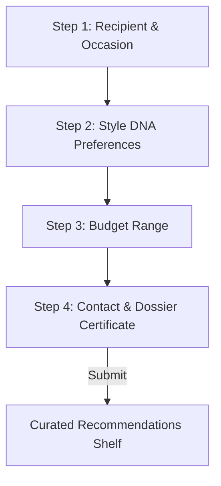
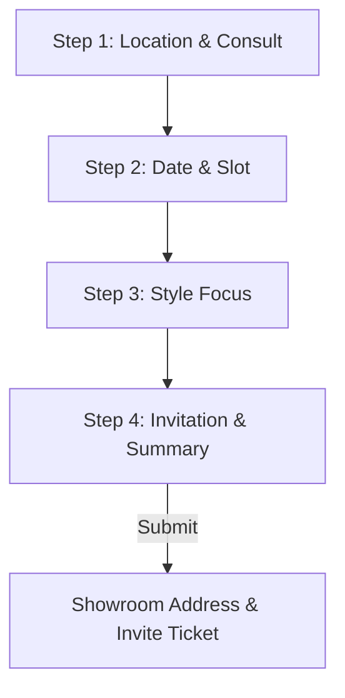

# Diavo Jewels Style Finder & Showroom Booking

An interactive, multi-step application built for **Diavo Jewels** ([diavojewels.com](https://diavojewels.com/)) supporting two separate user flows:
1.  **Style Finder Quiz**: Guides customers through recipient, occasion, and metal preferences to show a dynamically curated product recommendation tray matching their budget.
2.  **Bespoke Showroom Appointment**: Enables booking a VIP consultation slot (Bridal consultation, Custom design, Solitaire viewing) at physical showroom galleries.

---

## 🛠️ Tech Stack & CDNs

This project is built using a clean, vanilla frontend design system requiring zero builders:
*   **HTML5**: Structured semantic panels representing both styling and booking workflows.
*   **CSS3**: Custom design variables for gold/cream aesthetics, flexible tab selectors, hover animations, and card layouts.
*   **JavaScript (ES6+)**: Dual-flow state machine controlling flow toggles (`activeFlow: 'quiz' | 'showroom'`), validation, dynamic curation sorting, and slot calculations.

---

## 🧭 Operational Step Routines

The stepper dynamically toggles labels, steps, and progress bars based on the active tab.

### Style Finder Quiz Flow (4 Steps)

1.  **Recipient**: Partner, family, friend, or self and the occasion.
2.  **Preferences**: Metal choice (Gold, Silver, Rose Gold, Platinum) and jewelry/gemstone type.
3.  **Budget**: Filter budget segments (Silver daily accessory to diamond chokers).
4.  **Curation**: Contact details, 10% voucher code `DIAVO10`, and dynamic product tray rendering.

### Bespoke Showroom Appointment Flow (4 Steps)

1.  **Location & Consult**: Showroom location select (Delhi DLF Midtown or Moradabad Civil Lines) and consultation type.
2.  **Date & Slot**: Date selector and timing slots (Morning, Afternoon, Evening).
3.  **Style Focus**: Product focus area to prepare the showroom consultation display tray.
4.  **Invitation**: Input guest contact info and review VIP details.
5.  **Success Screen**: Displays a luxury invitation card showing the **exact physical showroom address** selected:
    *   **Delhi NCR**: `Shop No. G-12, Ground Floor, DLF Midtown Plaza, Shivaji Marg, Moti Nagar, New Delhi - 110015`
    *   **Moradabad**: `Plot 4B, Ground Floor, Civil Lines, Near Town Hall, Moradabad, Uttar Pradesh - 244001`

---

## 🚀 How to Run Locally

Since this is a client-side frontend project, no building or backend server setup is required:
1. Double-click [index.html](file:///c:/Pojects/Diavo-Jewels-Funnel/index.html) to open it in any web browser.
2. For testing responsiveness, toggle the inspect element view to mobile sizes.
